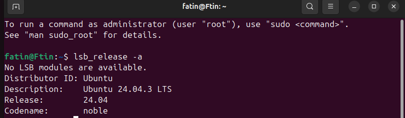
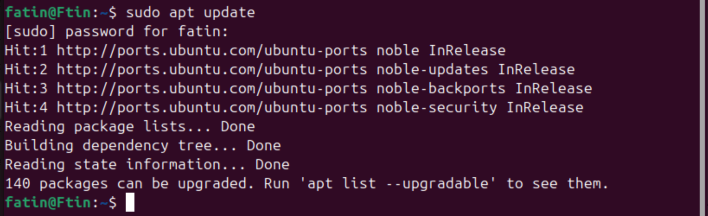
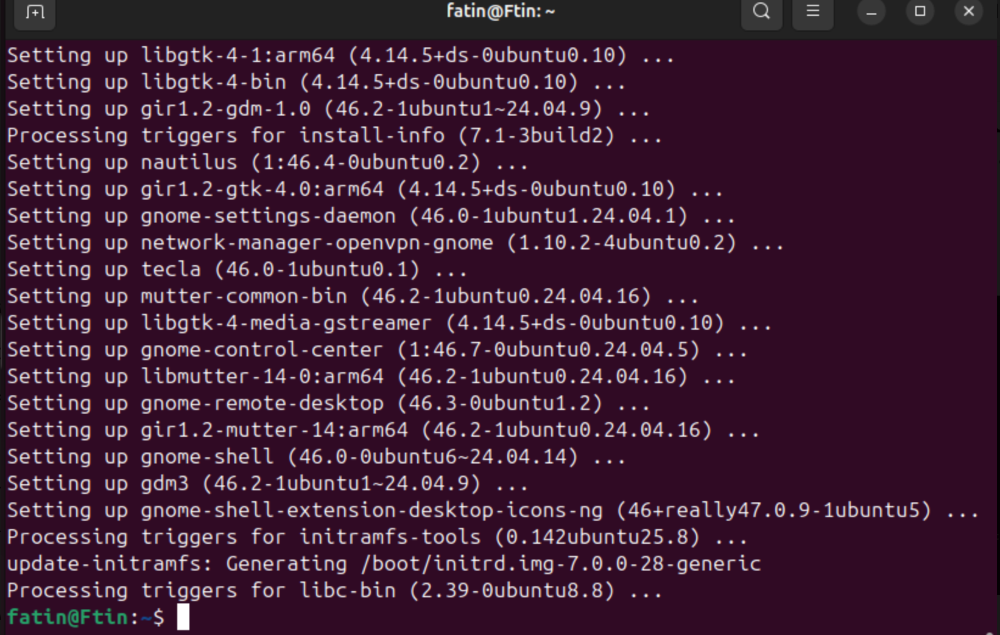
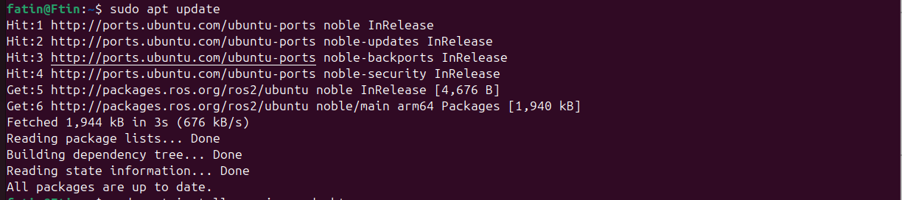
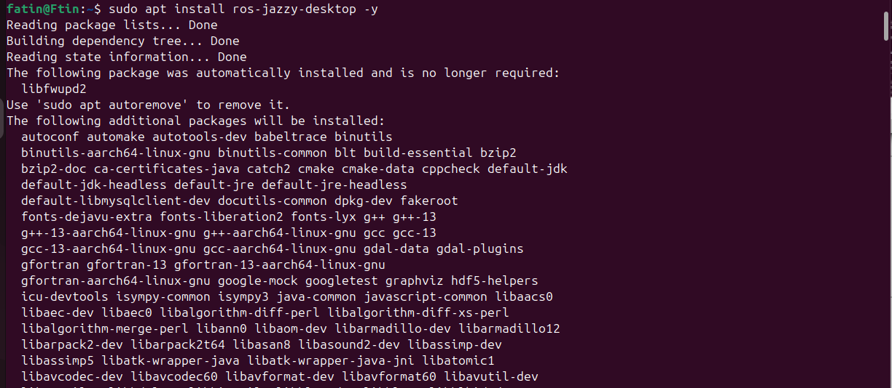
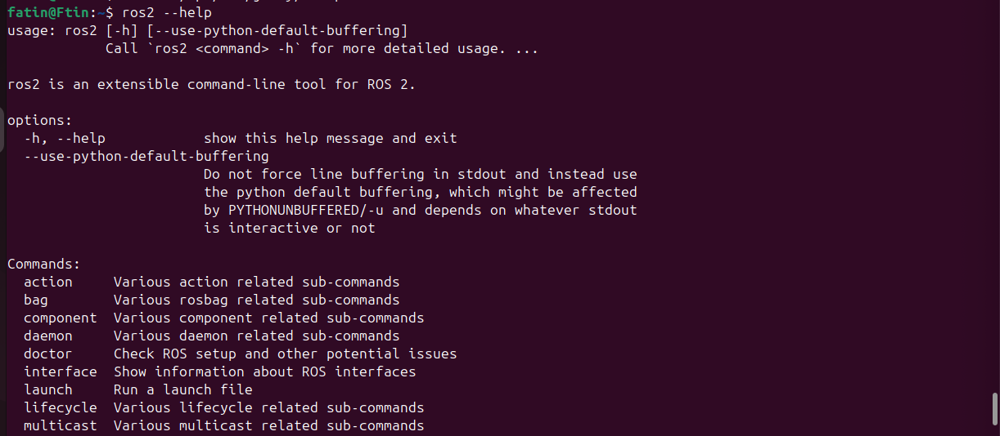
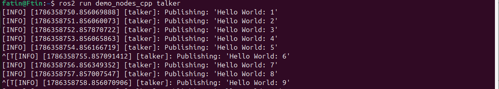
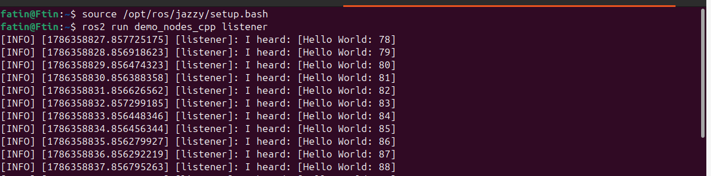

# ROS 2 Installation Report

## Description

This report documents the installation and testing of ROS 2 Jazzy on Ubuntu 24.04 LTS.

Ubuntu was installed on a virtual machine using VirtualBox on macOS.

## Environment

- Operating System: Ubuntu 24.04.3 LTS (Linux)
- ROS 2 Distribution: Jazzy
- Virtual Machine: VirtualBox
- Architecture: ARM64
- Host System: macOS

---

## 1. Check Ubuntu Version

First, the Ubuntu version was checked using:

```bash
lsb_release -a
```

The system is running Ubuntu 24.04.3 LTS (Noble).



---

## 2. Update Package List

The package list was updated using:

```bash
sudo apt update
```



---

## 3. Upgrade System Packages

The installed packages were upgraded using:

```bash
sudo apt upgrade -y
```



---

## 4. Install Required Tools

The required packages were installed using:

```bash
sudo apt install software-properties-common curl -y
```

Then, the Ubuntu Universe repository was enabled:

```bash
sudo add-apt-repository universe
```

---

## 5. Add ROS 2 Key

The ROS 2 repository key was added using:

```bash
sudo curl -sSL https://raw.githubusercontent.com/ros/rosdistro/master/ros.key -o /usr/share/keyrings/ros-archive-keyring.gpg
```

---

## 6. Add ROS 2 Repository

The ROS 2 repository was added using:

```bash
echo "deb [arch=$(dpkg --print-architecture) signed-by=/usr/share/keyrings/ros-archive-keyring.gpg] http://packages.ros.org/ros2/ubuntu $(. /etc/os-release && echo $UBUNTU_CODENAME) main" | sudo tee /etc/apt/sources.list.d/ros2.list > /dev/null
```

The package list was updated again:

```bash
sudo apt update
```



---

## 7. Install ROS 2 Jazzy

ROS 2 Jazzy Desktop was installed using:

```bash
sudo apt install ros-jazzy-desktop -y
```



---

## 8. Set Up ROS 2 Environment

The ROS 2 environment was activated using:

```bash
source /opt/ros/jazzy/setup.bash
```

To verify that ROS 2 was installed correctly:

```bash
ros2 --help
```



---

## 9. Test ROS 2 Talker

The ROS 2 Talker node was started using:

```bash
ros2 run demo_nodes_cpp talker
```

The Talker successfully published `Hello World` messages.



---

## 10. Test ROS 2 Listener

A second terminal was opened and the ROS 2 environment was activated:

```bash
source /opt/ros/jazzy/setup.bash
```

The Listener node was then started using:

```bash
ros2 run demo_nodes_cpp listener
```

The Listener successfully received the messages published by the Talker.



---

## Result

ROS 2 Jazzy was successfully installed and tested on Ubuntu 24.04 LTS. The Talker and Listener nodes communicated successfully, confirming that ROS 2 is working correctly.
